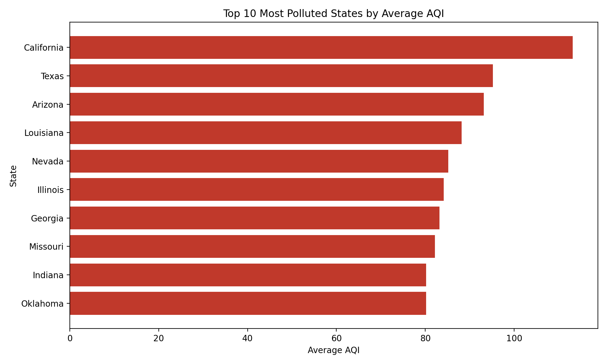
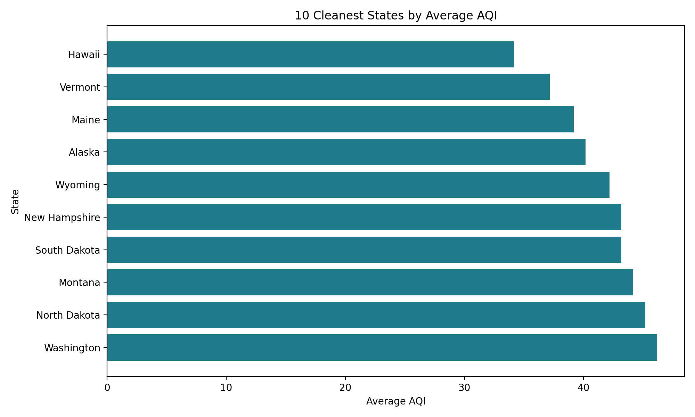
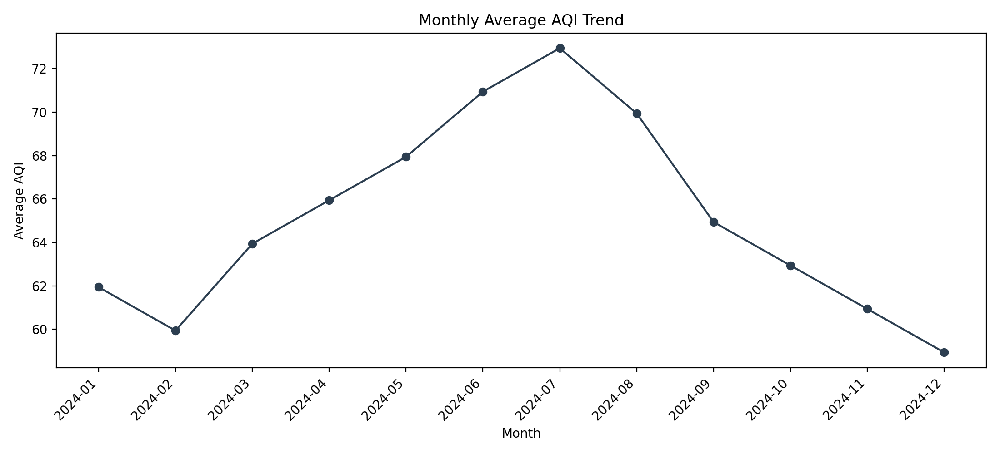
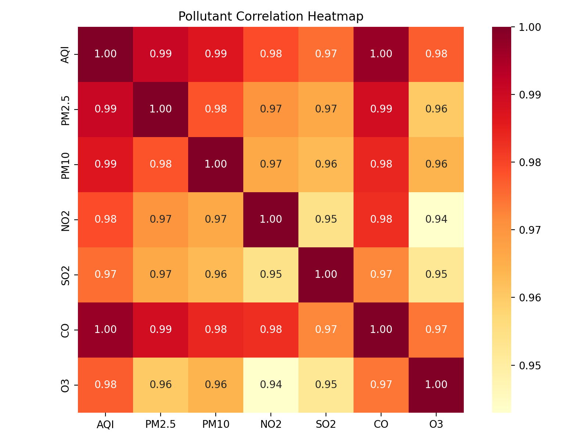
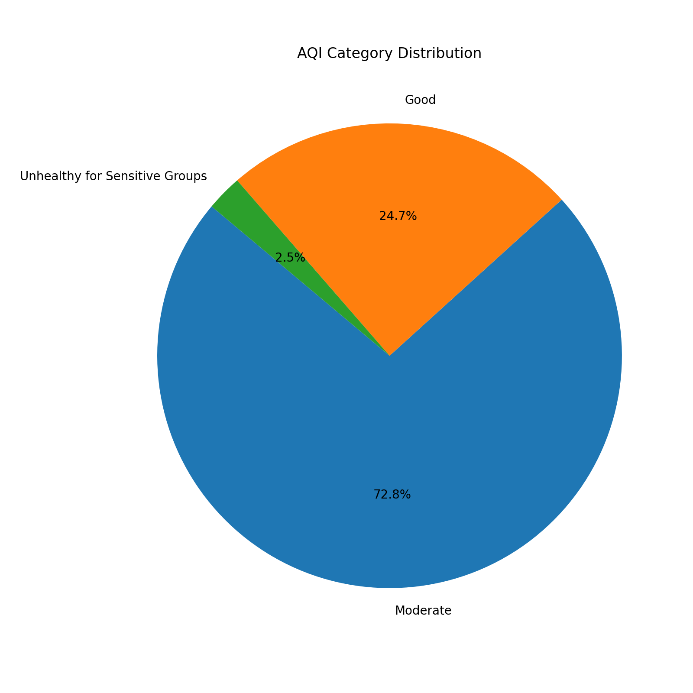

# USA Air Quality Analysis Dashboard

<p align="center">
  Analyze air quality across all 50 U.S. states with Python, build insights from AQI trends, and package the results for Tableau and GIS-style storytelling.
</p>

<p align="center">
  
</p>

<p align="center">
  <strong>Python</strong> · <strong>Pandas</strong> · <strong>Matplotlib</strong> · <strong>Seaborn</strong> · <strong>Tableau</strong>
</p>

## Overview

This project turns raw U.S. air quality data into a portfolio-ready analytics workflow:

- clean and standardize state-level AQI records
- calculate average AQI by state
- rank the most and least polluted states
- generate charts for storytelling
- prepare Tableau-ready dashboard files

## What This Project Delivers

- `State`-wise average AQI analysis across all 50 U.S. states
- pollution ranking tables for comparison
- monthly AQI trend summaries
- pollutant correlation analysis
- Tableau-ready files for dashboards and U.S. map views

## Visual Showcase

### Top 10 Polluted States


### 10 Cleanest States



### Monthly AQI Trend



### Pollutant Correlation Heatmap



### AQI Category Distribution



## Project Workflow

### Phase 1. Data Collection and Setup

Goal: gather a reliable dataset and organize the repository.

- download EPA or Kaggle air quality CSV data
- verify key columns such as `State`, `Date`, and `AQI`
- place original files in `data/raw/`

### Phase 2. Data Cleaning and Preparation

Goal: make the dataset analysis-ready.

- remove null values and duplicates
- standardize state names
- convert dates into usable datetime format
- retain core AQI and pollutant columns
- export cleaned files to `data/processed/`

### Phase 3. AQI Analysis and Visualization

Goal: compute the core insights.

- calculate average AQI per state
- create state pollution rankings
- build monthly AQI trends
- generate pollutant correlation analysis
- export charts to `visuals/`

### Phase 4. Dashboard and Portfolio Delivery

Goal: package the analysis for GitHub and Tableau.

- prepare Tableau-ready files
- build a U.S. AQI map and ranking dashboard
- create KPI cards and trend views
- finalize portfolio documentation

## Repository Structure

```text
USA_Air_Quality_Dashboard/
├── data/
│   ├── raw/
│   ├── processed/
│   └── external/
├── notebooks/
├── src/
├── visuals/
├── dashboard/
│   ├── tableau/
│   └── streamlit/
├── report/
├── docs/
├── tests/
├── .gitignore
├── README.md
└── requirements.txt
```

## Key Dataset Columns

Priority columns:

- `State`
- `City`
- `Date`
- `AQI`

Useful pollutant columns:

- `PM2.5`
- `PM10`
- `NO2`
- `SO2`
- `CO`
- `O3`

## Quick Start

Install dependencies:

```bash
pip install -r requirements.txt
```

Optional:

```bash
pip install streamlit
```

## Run The Pipeline

### 1. Clean raw data

```bash
python -m src.data_cleaning --input data/raw/your_file.csv
```

This step:

- saves a cleaned CSV into `data/processed/`
- saves a cleaning summary into `report/`
- standardizes common column-name variations

### 2. Run AQI analysis

```bash
python3 -m src.aqi_analysis --input data/processed/your_file_cleaned.csv
```

This step:

- creates `state_average_aqi.csv`
- exports monthly trend and AQI category tables
- generates chart images inside `visuals/`
- saves a Phase 3 summary into `report/`

### 3. Prepare Tableau dashboard assets

```bash
python3 -m src.dashboard_prep --input data/processed/your_file_cleaned.csv
```

This step:

- creates Tableau-ready summary files in `dashboard/tableau/`
- prepares KPI JSON for dashboard cards
- adds map-ready fields like `State_Code` and `Region`
- saves a Phase 4 manifest into `report/`

## Demo Dataset

If you want to test the project before downloading a real EPA or Kaggle dataset, generate the synthetic sample:

```bash
python3 -m src.generate_sample_data
```

This creates:

- `data/processed/sample_aqi_2024_cleaned.csv`

Important:

- this demo dataset is synthetic
- replace it with a real dataset before final portfolio publishing

## Tableau Outputs

The dashboard prep step creates files ready for Tableau:

- `dashboard/tableau/tableau_state_summary.csv`
- `dashboard/tableau/tableau_monthly_summary.csv`
- `dashboard/tableau/dashboard_kpis.json`

